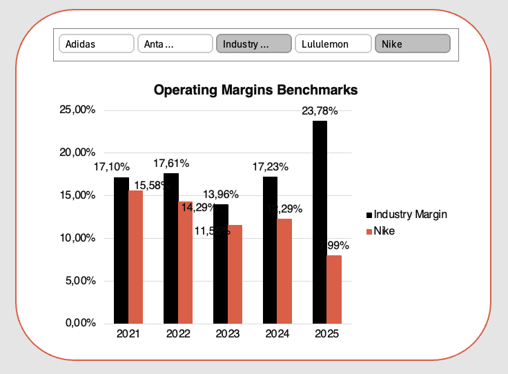
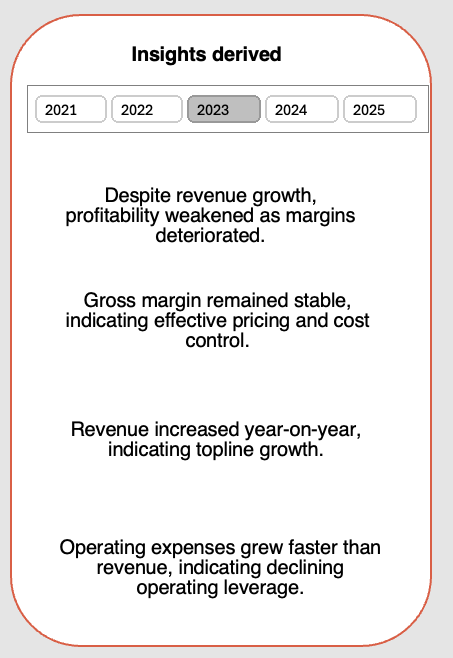

# Financial Statement Analysis

## Table of Contents
- [Project Overview](#Project-Overview)
- [Data Used](#Data-Used)
- [Dashboard Features](#Dashboard-Features)
- [Analytical Logic](#Analytical-Logic)
- [Tools & Skills Demonstrated](#Tools-&-Skills-Demonstrated)
- [Key Takeaways](#Key-Takeaways)
- [Future Improvements](#future-Improvements)
- [Author: Uphile Gama](#Author-Uphile-Gama)
- [Data source](#Data-source)

## Project Overview
This project is an Excel-based Financial Statement Analysis Dashboard built to analyse the historical performance of Nike Inc, a publicly listed US retail company. 

The goal of this project is to demonstrate my practical financial analysis skills, focusing on how financial statements are transformed into insights, visuals, and executive-level commentary, rather than soley relying on my background in the theory (BCom Accounting).

The dashboard is designed to replicate how financial performance is reviewed in real-world FP&A and analyst environments.

## Project Objectives 

- Analyse Nike’s financial performance across multiple years
- Identify key drivers of profitability and performance changes
- Compare company performance against industry benchmarks
- Visualise earnings movement using a waterfall chart
- Generate dynamic, slicer-driven insights and recommendations

## Data Used
The analysis is based on Nike’s publicly available financial statements:

- Income Statement
- Balance Sheet
- Cash Flow Statement

Derived data includes:

- Financial ratios
- Year-on-year variances
- Valuation multiples
- Forecasted revenue figures

Monetary Values are presented in USD Billions, clearly labelled across visuals for consistency and readability.

## Dashboard Features
### 1. KPI Summary Cards
The dashboard focususes on a core set of decision-driving KPIs:  
**Return on Equity:** It tells me if the "engine" is efficient. A high ROE suggests the company has a competitive moat and doesn't need to constantly borrow money to grow. 

**Operating Margin:** It filters out tax strategies and interest expenses, showing me the raw profitability of the core business model. If this is shrinking while revenue is growing, the business is becoming bloated.  

**Free Cash Flow:** It’s the money used to pay dividends, buy back shares, or acquire competitors. If a company has high profits but negative FCF, it’s a red flag that they aren't actually collecting the cash they claim to earn.  

**Debt-To-Equity:** It tells me how much "leverage" the company is using. High debt isn't always bad, but in a downturn, a high Debt-to-Equity ratio can lead to bankruptcy. I want to know if the company belongs to the bank or to the shareholders.  

**Cash Flow Quality:** It’s my "honesty check." If Net Income is $\$100\text{M}$ but Operating Cash Flow is only $\$20\text{M}$, the company might be using aggressive accounting to book sales that haven't been paid for yet. High-quality earnings should be backed by cash.

- Dynamic KPI tiles that update based on a Year slicer
- Provides a high-level financial snapshot for quick decision-making

 

### 2. Waterfall Chart (Earnings Bridge)
Visualises the change in Net Income year-on-year
Breaks earnings movement into:
- Revenue impact
- COGS impact
- Operating expense impact

Clearly highlights the primary driver of performance change.

### 3. Industry Benchmarck Comparison
Clustered chart comparing Nike’s key margins against industry averages

Helps contextualise performance beyond absolute numbers

### 4. Forecasting (Actual vs Forecast)
Revenue forecasting using historical trend-based methods

Actual and Forecast values displayed as separate series for clarity

Enables forward-looking analysis rather than purely historical review

### 5. Dynamic Insights & Recommendations
Pre-written insights driven by IF logic
Automatically update based on:

- Revenue growth
- Margin performance
- Cost behaviour

Mimics executive commentary found in analyst reports

## Analytical Logic
The project emphasises structure and reasoning, including:

- Variance analysis to explain year-on-year performance
- Separation of market-driven vs management-driven factors
- Consistent use of financial ratios rather than absolute values
- Alignment between visuals and written insights

## Tools & Skills Demonstrated
Microsoft Excel (Advanced):
- Pivot Tables & Pivot Charts
- GETPIVOTDATA
- Slicers
- Waterfall Charts
- IF & logical formulas

Financial Statement Analysis  
FP&A-style variance analysis  
Data storytelling & dashboard design  

## Key Takeaways 
- Financial analysis is not just about calculations — it’s about interpretation
- Well-designed dashboards should answer questions, not just display numbers
- Insights should adapt dynamically to reflect changing performance

## Future Improvements

- Expand forecasting models (scenario-based forecasting)
- Add cash flow–focused insights
- Incorporate valuation-driven recommendations

## Author: Uphile Gama
Aspiring Financial Data Analyst  
Focused on bridging finance and analytics through practical, real-world projects

## Data sources
 [Discounting Cash Flows](https://discountingcashflows.com/company/NKE/overview/) 

